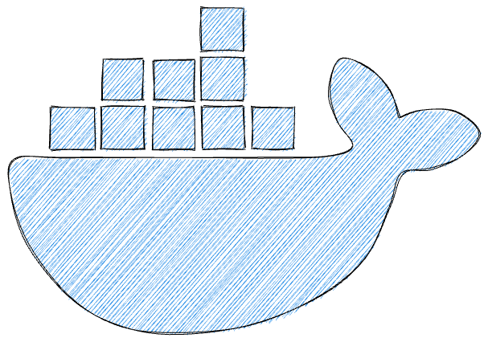
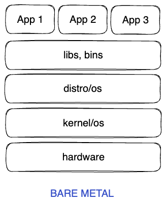
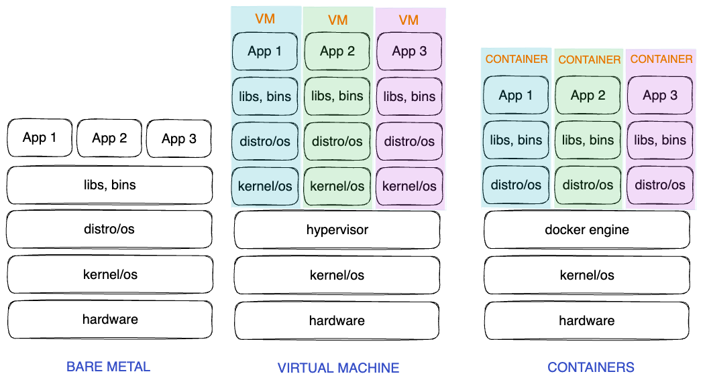
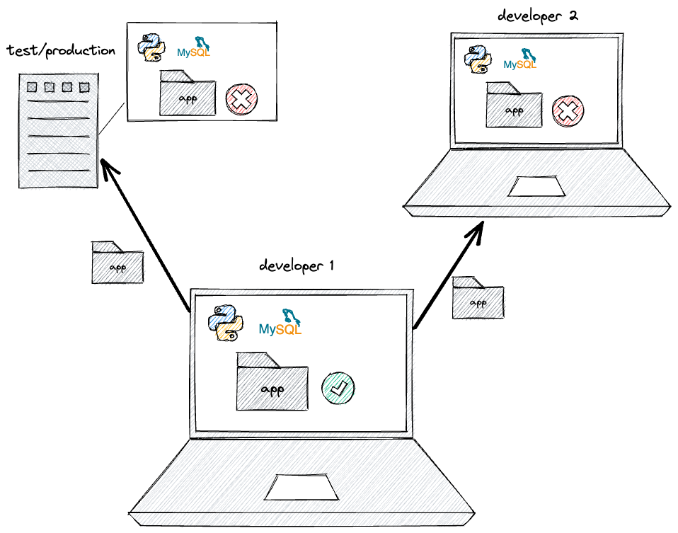
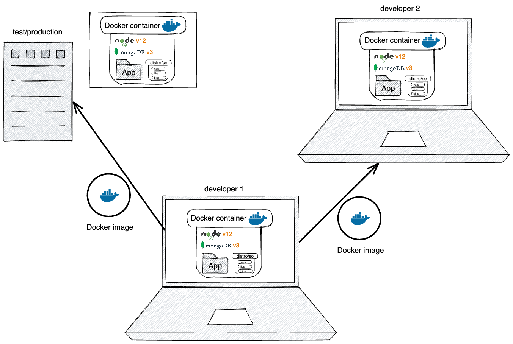
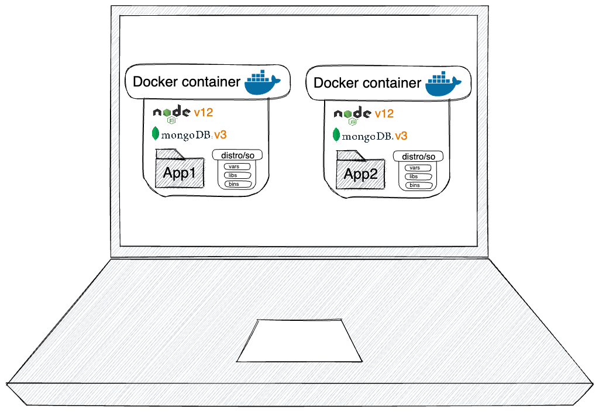

# Docker




Docker es una tecnología de virtualización que permite desarrollar, ejecutar y desplegar aplicaciones de forma consistente.

## Virtualización

> La virtualización es la tecnología que nos permite crear y administrar recursos virtuales que están aislados del hardware subyacente.

[Beneficios de la virtualización](https://www.vmware.com/es/solutions/virtualization.html)

### Hardware dedicado



- Ejecutar programas en el procesador sin abstracción del hardware
- Así funcionaban los grandes servidores y datacenters hasta el año 2000.
- En los inicios de internet para instalar un web server se necesitaba comprar o alquilar hardware dedicado
- Permiten maximizar el rendimiento
- Costes elevado de mantener, administrar y escalar los equipos. 

### Maquinas virtuales

El acceso masivo a internet impulsó el desarrollo de nuevas tecnologías de virtualización que permiten un uso más eficiente de los recursos informaticos.


- Abstracción sobre el hardware
- Permiten correr **multiples servicios** cada uno dentro de una instancia de OS que se ejecuta sobre otro OS host **con el mismo hardware**.
- El aislamiendo que brindan las MV agregan una capa de **seguridad** para los servicios que conviven en el mismo equipo.  
- Cada VM tiene asignada una cantidad de recursos de forma que si una agota sus recursos el resto no se ve afectada.
- Proveedores de Cloud Computing ofrecen infraestructura como servicio (IaaS) que permiten monitorizar, automatizar y escalar rápidamente el uso de recursos y adaptarlo a las necesidades y cambios de cada servicio.

[AWS](https://aws.amazon.com/es/)

## Client-Server

[CLIENTE-SERVIDOR](https://docs.google.com/presentation/d/1_lV8olhNttVp9Qrk08Zzh2TkIbir0ClSVkKL5LAPM0w/edit#slide=id.g15929a5bb27_0_41)

[python+flask](https://docs.docker.com/language/python/build-images/)
[python+flask+redis](https://docs.docker.com/compose/gettingstarted/)

## Solución Docker

Docker surge para cubrir las necesidad que tienen todavía las máquinas virtuales: 

- Aprovisionamiento
- Administración y actualizaciones de software
- Seguridad del sistema, etc. 
- Coste en rendimiento de tener que ejecutar un SO completo dentro de otro.
 




Al desarrollar programas en una máquina local es facil encontrar problemas cuando se ejecutan en otras máquinas:

- Por falta de archivos o partes de código fuente
- Por distintas versiones de alguna dependencia
- Por diferentes configuraciones en las variables de entorno del sistema




Docker permite empaquetar una app en lo que llama **image** con todo lo que necesita para ejecutarse.

Una imagen se puede descargar y ejecutar en otras máquinas dentro de un **container**.

Un contenedor es un proceso especial que corre en el SO Host y que usa herramientas del propio kernel del Host para envolver otros procesos brindandoles un entorno completamente aislado y con un sistema de ficheros dedicado.

1. Permite que la aplicación que funciona en tu entorno local funcione en cualquier otro entorno.

2. Agiliza el trabajo en equipo

	- Evita perder tiempo en instalar y configurar los entornos.
	- Nuevos miembro del equipo sólo tiene que ejecutar con Docker la app empaquetada para que todo funciones correctamente.
	- Evita mantener largas listas de versiones de las dependencias.





3. Permite ejecutar diferentes aplicaciones dentro de una misma máquina, manteniéndolos en entornos aislados que usen diferentes versiones de las mismas dependencias.





4. Los contenedores brindan muchas de las funcionalidades de seguridad y administración de recursos de las máquinas virtuales, pero sin el costo de tener que ejecutar un sistema operativo diferente.

6. Al compartir el kernel del SO host, todos los contenedores comparten su kernel teniendo acceso a todos los recursos físicos (memoria, cpu). Esto permite un uso más eficiente del hardware.


#### Arquitectura y Workflow
![[assets/architecture.svg]]
[Docker docs - arquitectura](https://docs.docker.com/get-started/overview/#:~:text=Docker%20architecture,to%20a%20remote%20Docker%20daemon)


## Imagenes y Contenedores

### Imagen

Una imagen incluye:

- distro/os
- Librerias de terceros
- Archivos de la app
- Variables de entorno

Es el estado de una aplicación y todo lo que necesita, empaquetado y comprimido para que pueda montar más tarde en un contendor

```bash
docker image ls # images
docker images # images
```

###  Contenedor

```bash
docker ps # containers corriendo
docker ps -a # incluir containers parados
```

Un contenedor es un entorno aislado donde se ejecuta una aplicación de acuerdo a una imagen. Es un proceso especial del OS Host que tiene su propio sistema de ficheros. 


### Ejecutar contenedor con una imagen de ubuntu sacada de Docker Hub

1. https://hub.docker.com/_/ubuntu
```bash
docker pull ubuntu
docker image ls
```

2. Montar un contendor ejecutando una imagen descargada 

`-t flag : especifica el tag de la iamgen` 
`-i : modo de ejecución interactivo del contendor para ejecutar comandos desde la shell mientras esté corriendo`

```bash
docker run -it ubuntu
```

Cada ejecución de una imagen crea un nuevo contenedor, con un sistema de archivos diferente e invisible para el resto de contenedores. 

```bash
docker start -ai container_name ### Arranca un contenedor parado
```

#### Ejemplo

1. Crea un contenedor de la imagen ubuntu
2. Crea algun archivo con texto en el en la carpeta del usuario `~/`
3. Crea otro contenedor de la misma imagen ubuntu
4. Comprueba que el contenedor tiene una id diferente al anterior
5. Comprueba que no tiene el archivo creado en el otro contenedor.


### Dockerizar app

Podemos dockerizar cualquier tipo de aplicación.

Para ejecutar un programa creado con una teconología (node/python, etc) debemos seguir los siguientes pasos:

1. Poner en marcha tu sistema operativo
2. Instalar node/python
3. Instalar dependencias
```bash
npm install
```
4. Copiar todos los archivos de la app

```js
console.log("hello, World!") // app.js
```

5. Correr tu aplicacón de node
```bash
node app.js
```


### 1. Dockerfile 

Archivo con las instrucciones para crear una imagen


##### FROM

Imagen base 

Sistema operativo (Linux o Windows) o uno de estos SO y un entorno de ejecuión

```docker
FROM python:alpine3.17
```

Crear imagen:

```bash
docker buildx -t first-app . ## el último argumento es el build context
## Docker client envia el build context al docker server y este empezará a ejecutar los comandos del Dockefile, Docker engine no tendrá acceso fuera de directorio (build context)
docker image ls
```

Ejecutar imagen:

```bash
docker run -it first-app ## REPL python
docker run -it first-app sh ## REPL sh (El último argumento es el comando que se ejecutará en el sistema cuando se inicia el contenedor)
docker image ls
```

#### COPY
Copia archivos desde el build context hasta un path desde el working directory de la imagen. 


```docker
FROM python:alpine3.17
COPY . /app 
```

El comando anterior COPY crea la carpeta `/app` si no existe en el sistema de archivos de la imagen y copia todos los archivos que hay en el build context.

#### WORKDIR

Cambia el current working directory en la imagen

```docker
FROM python:alpine3.17
COPY . /app 
WORKDIR /app
```

Podemos excluir directorios y archivos del build context añadiendo el path al archivo `.dockerignore`

#### RUN

Ejecutar comandos en la shell del sistema

```docker
FROM python:alpine3.17
COPY . /app 
WORKDIR /app
RUN pip install -r requirements.txt
```

#### ENV

Establece variables de entorno


```bash
FROM python:alpine3.17
COPY . /app 
WORKDIR /app
RUN pip install -r requirements.txt
ENV MONGO_URI=mongodb://path
```

#### EXPOSE

Expone un puerto que esta a la escucha para que pueda ser mapeado desde el os host. No se mapea automaticamente, hay que mapearlo al construir el contenedor. 

```bash
FROM python:alpine3.17
COPY . /app 
WORKDIR /app
RUN pip install -r requirements.txt
ENV MONGO_URI=mongodb://path
EXPOSE 5000
```


##### CMD

Comando que ejecutará una vez ponga en marcha el contenedor.

```docker
FROM python:alpine3.17
COPY . /app 
WORKDIR /app
RUN pip install -r requirements.txt
CMD python3 app.py
```


Compilar la imagen. Con buildx realizamos una compilación multiplataforma. 

```bash
docker build -t image-name .
```
https://labs.play-with-docker.com/
https://docs.docker.com/samples


Una vez tenemos la imagen

```bash
docker image ls 
```

Podemos montar un contendor:

```bash
docker run -it image-name sh
```

O Podemos subirla al Registry de Docker Hub para descargarla desde otras máquinas


Hacemos login

```bash
docker login
```


https://docs.docker.com/docker-hub/repos/create/

Cambiamos el tag de la imagen al formato que necesita Docker Hub

```bash
docker tag name-image user/name-repo:tag
```

Subimos la imagen al repo

```bash
docker push user/name-repo:tag
```

También podemos subir una compilación multiplataforma para que se pueda ejecutar en maquinas con cpus de distinta arquitectura:

De esta forma dsde cualquier otra maquina o (test, prod, otro dev) se puede hacer pull de la imagen y poner en marcha el contenedor con la misma imagen que contendra una version especifica de nuestra aplicación con todas sus dependencias. 

https://labs.play-with-docker.com/


### Limpiar imagenes, contenedores, etc

```bash 
docker image -q` # imageIds
docker image rm id1 id2
docker image rm $(docker image ls -q) # borrará todas las imagenes si no hay contenedores corriendo estas imagenes, aunque estén parados los contendores lanzará un errror
```

Para ello eliminamos primero todos los contenedores 

`docker container rm -f $(docker container ls -a -q) // la bandera -a también (-f forazara el borrado de contenedores corriendo) traera los contenedores parados

Desde la UI de docker DEPURACION> podemos borrar todas las imagenes, containers, volumenes, etc alamacenado con "Clean and purge data"


## Manejando contenedores 

Podemos ejecutar un contendor en segundo plano con la bandera -d 

```bash
docker run -dt image-name
```

Podemos asignarle nombres para trabajar más facil con ellos


```bash
docker run --name app-python -dt image-name
```


Podemos consultar logs de los contenedores que estan corriendo en segundo plano

```bash
docker logs c1
docker logs --help
docker logs -n 2 c1
```

Podemos ejecutar comandos en un contenedor en ejecución con 

```bash
docker exec name-container ls
docker exec -it name-container sh
```

Los contenedores se pueden parar y arrancar
```bash
docker stop
docker start
```


## Mapear puerto del contenedor con el host

Ahora el proceso que está escuchando dentro del contenedor en el puerto 5001 y expuesto, es mapeado con el puerto 80 del host. 

```bash
docker run -td --name name-container -p 80:5001 name-image
```


## Volumen

Los volumenes son almacenamientos fuera del contenedor que pueden sincronizarse con el sistema interno de directorios. Pueden usarse volumenes alojados en el host o de otra fuente externa. 

Es el mecanismo para conseguir la persistencia de datos en las aplicaciones dockerizadas. De esta forma puedemos borrar contenedores sin perder datos y crear nuevos contenedores que compartan datos con otros. 

Crear volume

```bash

docker volume create data

docker volume inspect data
```


Mapear volume con filesystem del contenedor

```bash
docker run -td --name name-container -p 80:5001 -v data:/app/data name-image

# Si el volume no se ha creado con esta linea se crea directamente un volumen con el nombre dado (data)
```


## Docker Compose

```bash
docker-compose build
docker-compose up
docker-compose stop
docker-compose logs


```